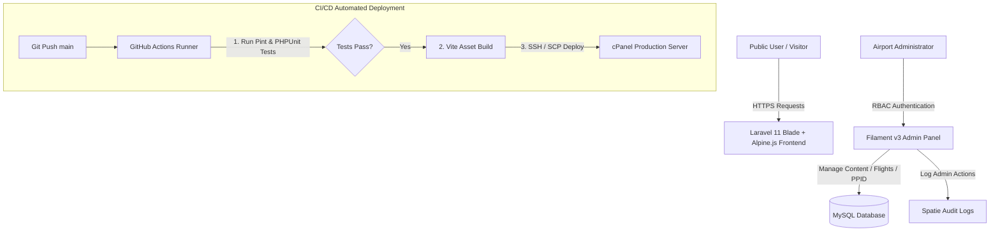

# 🛫 Official Airport Portal — Bandara Kalimarau (Showcase & Case Study)

[](https://laravel.com)
[](https://filamentphp.com)
[](https://tailwindcss.com)
[](https://alpinejs.dev)
[](https://mysql.com)
[](https://github.com)

> 💡 **Public Showcase Note**: Repositori ini dipublikasikan secara khusus sebagai **studi kasus & portofolio teknis**. Seluruh *source code* produksi disimpan di repositori privat untuk melindungi kekayaan intelektual (*Intellectual Property*) dan kredensial server.

---

## 📌 Ringkasan Proyek

Situs resmi **Bandara Kalimarau (Berau, Kalimantan Timur)** merupakan platform web modern yang dirancang untuk menggantikan sistem lama (WordPress) dengan arsitektur **Laravel 11 & Filament v3**. 

Proyek ini menghadirkan peningkatan signifikan pada kecepatan akses, keamanan data publik, pengarsipan dokumen resmi PPID, jadwal penerbangan interaktif, serta sistem manajemen konten (CMS) berkelas enterprise.

---

## 🌟 Fitur Utama & Keunggulan Teknikal

- ✈️ **Real-Time Flight Schedule Management**: Manajemen jadwal penerbangan kedatangan dan keberangkatan secara efisien melalui Filament Admin.
- 📁 **Pengarsipan Dokumen PPID**: Sistem pengarsipan dokumen publik transparan dan terstruktur sesuai standar pelayanan informasi publik.
- 🔐 **Role-Based Access Control (RBAC) & Audit Trail**: Manajemen otorisasi pengguna berbasis Spatie Permission dilengkapi pencatatan aktivitas (*Audit Logs*) otomatis untuk setiap aksi sensitif.
- 🎨 **Navy & Gold Design System**: Antarmuka responsif modern berstandar tinggi dengan transisi *smooth* Alpine.js dan komponen Tailwind CSS terspesialisasi.
- 🚀 **Otomasi CI/CD Pipeline**: Pengujian otomatis (PHPUnit) dan *deployment* otomatis ke server produksi (cPanel via SSH/SCP) setiap kali ada perubahan pada *branch* `main`.
- ⚡ **High Performance & Modern Caching**: Optimasi query database dan *asset bundling* dengan Vite.

---

## 📐 Arsitektur Sistem & Workflow



---

## 💻 Sample Code Snippets (Teknikal Highlights)

Berikut adalah beberapa contoh arsitektur kode dan implementasi komponen dalam proyek ini:

### 1. Custom Resource & Audit Trail (Filament v3)
```php
namespace App\Filament\Resources;

use App\Models\FlightSchedule;
use Filament\Resources\Resource;
use Filament\Tables;
use Filament\Forms;

class FlightScheduleResource extends Resource
{
    protected static ?string $model = FlightSchedule::class;
    protected static ?string $navigationIcon = 'heroicon-o-paper-airplane';

    public static function form(Forms\Form $form): Forms\Form
    {
        return $form
            ->schema([
                Forms\Components::TextInput::make('flight_number')
                    ->required()
                    ->maxLength(20),
                Forms\Components::TextInput::make('airline')
                    ->required(),
                Forms\Components::DateTimePicker::make('scheduled_at')
                    ->required(),
                Forms\Components::Select::make('status')
                    ->options([
                        'scheduled' => 'Scheduled',
                        'delayed'   => 'Delayed',
                        'departed'  => 'Departed',
                        'landed'    => 'Landed',
                    ])
                    ->required(),
            ]);
    }
}
```

### 2. Standardized Design Tokens & UI Entry Animations (Alpine.js)
```html
<div x-data="{ loaded: false }" 
     x-init="setTimeout(() => loaded = true, 100)"
     class="bg-white py-8 px-6 rounded-xl shadow-sm border border-gray-100">
    <h1 x-show="loaded" 
        x-transition:enter="transition-all ease-out duration-700 delay-100"
        class="font-sans text-3xl md:text-5xl font-extrabold text-navy-dark leading-tight mb-4">
        Profil Bandara Kalimarau
    </h1>
    <div x-show="loaded" 
         x-transition:enter="transition-all ease-out duration-700 delay-300"
         class="h-1.5 w-20 bg-gold-light rounded-full mb-6"></div>
</div>
```

---

## 📊 Kualitas & Pengujian Kode (*Quality Assurance*)

Proyek ini dibangun dengan standar kualitas yang ketat:
- **Test Suite**: 37+ pengujian PHPUnit yang mencakup fitur autentikasi, akses halaman publik, dan otorisasi admin.
- **Code Style**: Memenuhi standar PSR-12 dan diverifikasi menggunakan **Laravel Pint**.

```bash
# Perintah pengujian lokal
vendor/bin/pint --test
php artisan test
```

---

## 📄 Hak Cipta & Informasi Lisensi

```text
Copyright © 2026 Ananta Raihan Fatih. All rights reserved.

This repository is published solely for portfolio demonstration, architectural review,
and professional technical evaluation. 

No permission is granted to clone, copy, modify, merge, publish, distribute, sublicense, 
or sell any part of this software for commercial or production purposes.
```

---

<p center>
  Developed with ❤️ by <strong>Ananta Raihan Fatih</strong> — Fullstack Web Developer
</p>
